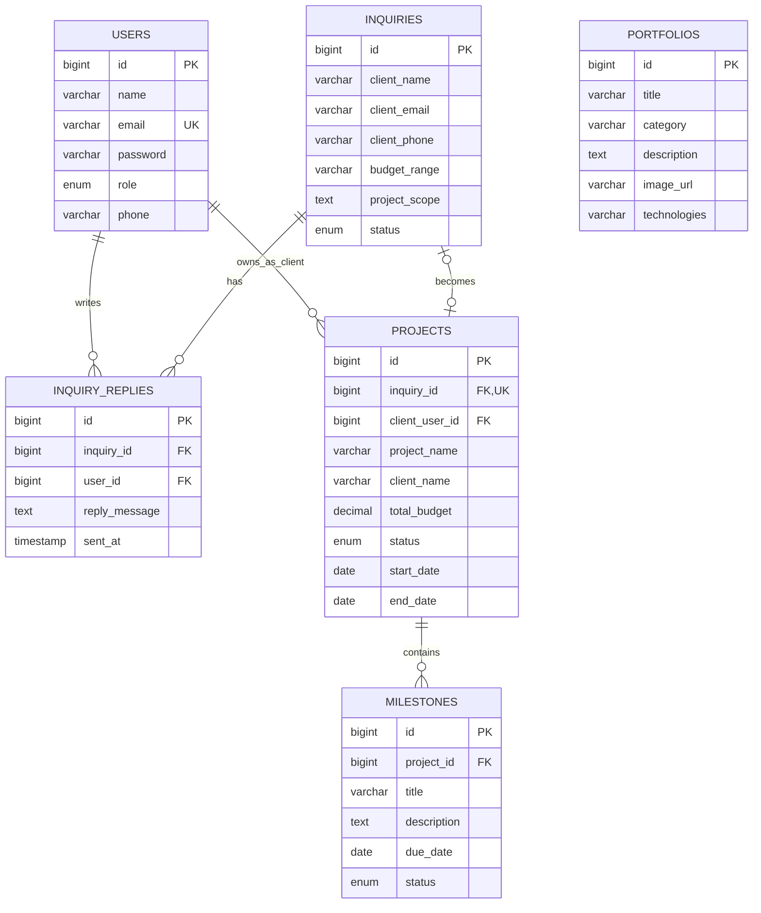

# สถาปัตยกรรมระบบ MONSTOPIA

เอกสารฉบับนี้อธิบายโครงสร้างสำหรับใช้อ้างอิงในบทที่ 3 ของปริญญานิพนธ์ โดย migration ใน `database/migrations` เป็นแหล่งข้อมูลจริงของ Schema

## 1. System Architecture

```text
Browser (HTML/CSS/Vanilla JS + Fetch API)
        │ HTTPS / JSON / Session cookie / CSRF token
        ▼
Laravel 12
├── Form Request Validation
├── Authentication + Role Middleware
├── REST-style Controllers
├── Eloquent Models / Transactions
├── SMTP Mail
└── LINE Messaging API
        │ PDO MySQL
        ▼
MySQL 8 (InnoDB, utf8mb4)
```

Frontend ไม่มีขั้นตอนคอมไพล์ Node/esbuild ไฟล์ที่ Browser ใช้อยู่ใน `public` โดยตรง Backend ใช้ Laravel Session แบบ HttpOnly, CSRF protection และ Bcrypt สำหรับรหัสผ่าน

## 2. สิทธิ์ผู้ใช้

| บทบาท | สิทธิ์ |
|---|---|
| Guest | ดูเว็บไซต์/Portfolio และส่งบรีฟ |
| Client | สิทธิ์ Guest + ดูเฉพาะ Project/Milestone ที่ `projects.client_user_id` ตรงกับบัญชีตนเอง |
| Staff | ดูและจัดการ Portfolio, Inquiry/Reply, Project และ Milestone แต่จัดการบัญชีผู้ใช้ไม่ได้ |
| Administrator | สิทธิ์ Staff + CRUD บัญชีและกำหนด Role |

ค่าเริ่มต้นของ `users.role` เป็น `client` ตามหลัก Least Privilege ไม่ใช้ `staff` เป็นค่าเริ่มต้น เพราะอาจให้สิทธิ์หลังบ้านโดยไม่ได้ตั้งใจ

## 3. ER Diagram



`client_user_id` เป็นคอลัมน์เพิ่มเติมจากโครงร่างแรกและจำเป็นต่อการบังคับ Ownership ฝั่ง Server การใช้อีเมลค้นหา Project โดยตรงเพียงอย่างเดียวเสี่ยงต่อการเปิดเผยข้อมูลและการสะกดอีเมลไม่ตรงกัน

## 4. Data Dictionary

ทุกตารางใช้ `id BIGINT UNSIGNED AUTO_INCREMENT` เป็น Primary Key ตารางที่ระบุ timestamps มี `created_at` และ `updated_at`

### users

| Field | Type / Constraint | ความหมาย |
|---|---|---|
| name | VARCHAR(100), NOT NULL | ชื่อผู้ใช้ |
| email | VARCHAR(150), UNIQUE, NOT NULL | อีเมลเข้าสู่ระบบ |
| password | VARCHAR(255), NOT NULL | รหัสผ่าน Bcrypt |
| role | ENUM(admin, staff, client), default client | ระดับสิทธิ์ |
| phone | VARCHAR(20), NULL | เบอร์โทร |
| timestamps | TIMESTAMP, NULL | เวลาสร้าง/แก้ไข |

### portfolios

| Field | Type / Constraint | ความหมาย |
|---|---|---|
| title | VARCHAR(150), NOT NULL | ชื่อผลงาน |
| category | VARCHAR(50), INDEX, NOT NULL | หมวดหมู่ |
| description | TEXT, NOT NULL | รายละเอียด |
| image_url | VARCHAR(255), NOT NULL | URL ภาพหน้าจอจริง |
| technologies | VARCHAR(255), NULL | เทคโนโลยี |
| timestamps | TIMESTAMP, NULL | เวลาสร้าง/แก้ไข |

### inquiries

| Field | Type / Constraint | ความหมาย |
|---|---|---|
| client_name | VARCHAR(100), NOT NULL | ผู้ติดต่อ/บริษัท |
| client_email | VARCHAR(150), INDEX, NOT NULL | อีเมลติดต่อ |
| client_phone | VARCHAR(20), NOT NULL | เบอร์โทร |
| budget_range | VARCHAR(50), NOT NULL | ช่วงงบประมาณ |
| project_scope | TEXT, NOT NULL | รายละเอียดบรีฟ |
| status | ENUM(pending, contacted, accepted, rejected), default pending | สถานะการประสานงาน |
| timestamps | TIMESTAMP, NULL | เวลาสร้าง/แก้ไข |

### inquiry_replies

| Field | Type / Constraint | ความหมาย |
|---|---|---|
| inquiry_id | BIGINT UNSIGNED, FK, CASCADE DELETE | บรีฟที่อ้างอิง |
| user_id | BIGINT UNSIGNED, FK, RESTRICT DELETE | ผู้ตอบ |
| reply_message | TEXT, NOT NULL | ข้อความตอบกลับ |
| sent_at | TIMESTAMP, default CURRENT_TIMESTAMP | เวลาส่ง |

### projects

| Field | Type / Constraint | ความหมาย |
|---|---|---|
| inquiry_id | BIGINT UNSIGNED, UNIQUE, FK, NULL | บรีฟตั้งต้น |
| client_user_id | BIGINT UNSIGNED, FK, NULL ในฐานข้อมูล/Required ใน API | เจ้าของโครงการที่เข้าระบบได้ |
| project_name | VARCHAR(150), NOT NULL | ชื่อโครงการ |
| client_name | VARCHAR(100), NOT NULL | ชื่อลูกค้า/องค์กร |
| total_budget | DECIMAL(10,2), NOT NULL | มูลค่าโครงการ; ไม่ส่งให้ Client API |
| status | ENUM(active, completed, archived), default active | สถานะโครงการ |
| start_date | DATE, NOT NULL | วันเริ่ม |
| end_date | DATE, NULL | วันสิ้นสุด |
| timestamps | TIMESTAMP, NULL | เวลาสร้าง/แก้ไข |

### milestones

| Field | Type / Constraint | ความหมาย |
|---|---|---|
| project_id | BIGINT UNSIGNED, FK, CASCADE DELETE | โครงการ |
| title | VARCHAR(150), NOT NULL | ชื่องวดงาน |
| description | TEXT, NULL | รายละเอียดส่งมอบ |
| due_date | DATE, NOT NULL | กำหนดส่ง |
| status | ENUM(pending, in_progress, delivered, approved), default pending | สถานะงวดงาน |
| timestamps | TIMESTAMP, NULL | เวลาสร้าง/แก้ไข |

## 5. Internal API

| Endpoint | Method | Role | การทำงาน |
|---|---|---|---|
| `/api/csrf` | GET | Public | รับ CSRF token สำหรับ same-origin Fetch |
| `/api/portfolios` | GET | Public | อ่านผลงาน |
| `/api/inquiries` | POST | Public, rate limited | Validation + บันทึกบรีฟ + แจ้ง LINE |
| `/api/auth/login` | POST | Public, rate limited | สร้าง Session |
| `/api/auth/me` | GET | Public | ตรวจ Session ปัจจุบัน |
| `/api/auth/logout` | POST | Authenticated | ยกเลิก Session |
| `/api/admin/clients` | GET | Admin, Staff | อ่านบัญชี Client สำหรับผูก Project |
| `/api/admin/portfolios` | POST | Admin, Staff | เพิ่มผลงาน |
| `/api/admin/portfolios/{id}` | PUT/DELETE | Admin, Staff | แก้ไข/ลบผลงาน |
| `/api/admin/inquiries` | GET | Admin, Staff | อ่านรายการบรีฟและคำตอบ |
| `/api/admin/inquiries/{id}/reply` | POST | Admin, Staff | บันทึก Reply/Status แล้วส่งอีเมล |
| `/api/admin/projects` | GET/POST | Admin, Staff | อ่าน/เปิดโครงการ |
| `/api/admin/projects/{id}` | PUT/DELETE | Admin, Staff | แก้ไข/Archive โครงการ |
| `/api/admin/projects/{id}/milestones` | GET/POST | Admin, Staff | อ่าน/เพิ่ม Milestone |
| `/api/admin/projects/{id}/milestones/{milestone}` | PUT | Admin, Staff | อัปเดต Milestone ใน Project ที่ตรงกัน |
| `/api/admin/users` | GET/POST | Admin | อ่าน/สร้างบัญชี |
| `/api/admin/users/{id}` | PUT/DELETE | Admin | แก้ไข/ลบบัญชี |
| `/api/client/projects` | GET | Client | อ่าน Project/Milestone ของบัญชีปัจจุบัน |

## 6. Security Decisions

- Session ID อยู่ใน cookie แบบ HttpOnly; Production บังคับ Secure cookie ผ่าน `.env`
- State-changing request ผ่าน CSRF middleware และ Validate Request ฝั่ง Server
- Login และฟอร์ม Public มี rate limiting
- Password ใช้ Laravel Hash driver `bcrypt`; ไม่มีรหัสผ่านเริ่มต้นใน Seeder
- Client query เริ่มจาก Relationship ของผู้ใช้ ไม่รับ client/project id จาก Browser
- Nested Milestone update ตรวจว่า `milestone.project_id` ตรงกับ Project ใน URL
- Email/LINE failures ถูก Log โดยไม่เปิดเผย token และไม่ย้อนข้อมูล Inquiry ที่บันทึกสำเร็จแล้ว
- Project delete ใน API หมายถึง Archive เพื่อรักษาประวัติการดำเนินงาน

## 7. External references

- Laravel 12 Authentication: <https://laravel.com/docs/12.x/authentication>
- Laravel 12 CSRF Protection: <https://laravel.com/docs/12.x/csrf>
- Laravel 12 Database: <https://laravel.com/docs/12.x/database>
- LINE Notify discontinuation: <https://notify-bot.line.me/closing-announce>
- LINE Messaging API push: <https://developers.line.biz/en/reference/messaging-api/#send-push-message>
